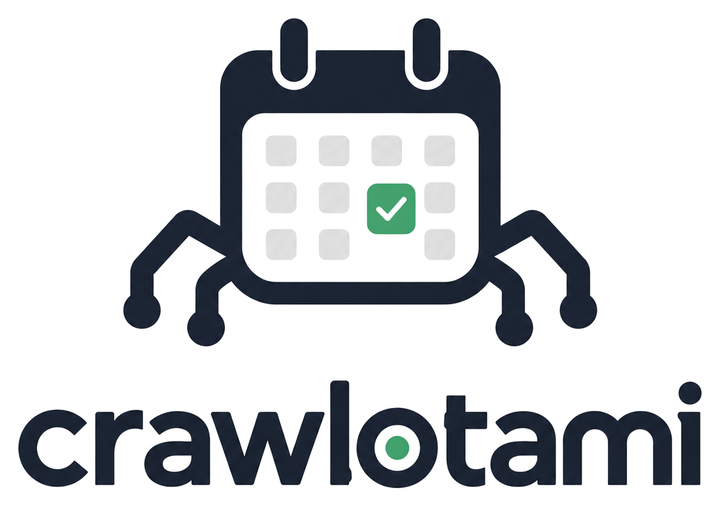
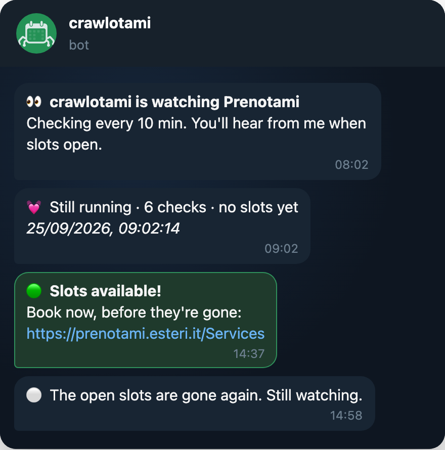
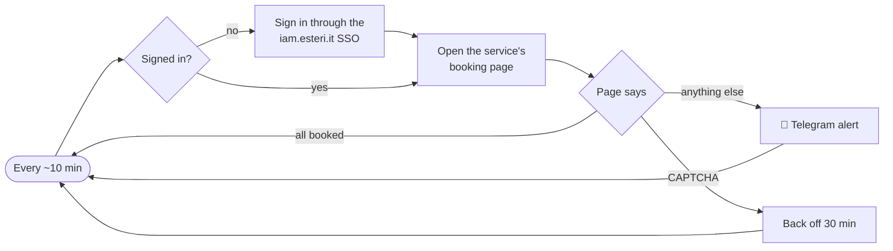

<p align="center">
  <picture>
    <source media="(prefers-color-scheme: dark)" srcset="docs/assets/logo-dark.png">
    
  </picture>
</p>

<p align="center">
  <b>Get a Telegram message the moment Prenotami opens appointment slots.</b><br>
  A small, self-hosted watcher for Italian consulate bookings.
</p>

<p align="center">
  <a href="https://github.com/zontaggio/crawlotami/actions/workflows/ci.yml"></a>
  <a href="https://github.com/zontaggio/crawlotami/releases/latest"></a>
  
  
  <a href="LICENSE"></a>
</p>

<p align="center">
  
</p>

## Why

Passport and citizenship appointments on [Prenotami](https://prenotami.esteri.it/) open rarely and are gone within minutes. Catching one means refreshing the booking page all day. crawlotami does the refreshing for you and messages you on Telegram as soon as the page stops saying _"all appointments for this service are currently booked"_.

## Features

- **Alerts that matter.** One message when slots open, with a direct link to book, and one when they're gone. No repeats in between.
- **Proof of life.** A periodic heartbeat, so silence means "no slots", not "the bot died".
- **Recovers on its own.** Expired sessions trigger a fresh sign-in; if Prenotami shows a CAPTCHA, crawlotami backs off for 30 minutes instead of retrying.
- **Gentle by default.** Checks every 10 minutes, and never more often than every 5.
- **Runs anywhere.** Locally with Node.js, or around the clock with Docker Compose.
- **Tiny and typed.** Strict TypeScript, three runtime dependencies (all Playwright), tested without a browser.

## Quick start

### 1. Create your Telegram bot

1. Talk to [@BotFather](https://t.me/BotFather), send `/newbot` and copy the token.
2. Get your chat ID from [@userinfobot](https://t.me/userinfobot).
3. Send `/start` to your new bot, otherwise it isn't allowed to message you.
4. _Optional:_ give it a face with `/setuserpic` and [`docs/assets/avatar.png`](docs/assets/avatar.png).

### 2. Configure

```bash
git clone https://github.com/zontaggio/crawlotami.git
cd crawlotami
cp .env.example .env   # then fill in your Prenotami login and Telegram details
```

### 3. Run

With Docker (recommended for running 24/7):

```bash
docker compose up -d
docker compose logs -f
```

Or with Node.js 22+:

```bash
npm install
npm run build
npm run notify:test   # sends a test message to check the Telegram setup
npm start
```

## Configuration

Settings come from `.env` (or real environment variables, e.g. in Docker).

| Variable                 | Default             | Description                                                             |
| ------------------------ | ------------------- | ----------------------------------------------------------------------- |
| `PRENOTAMI_EMAIL`        | _required_          | Your Prenotami login                                                    |
| `PRENOTAMI_PASSWORD`     | _required_          | Your Prenotami password                                                 |
| `TELEGRAM_BOT_TOKEN`     | _required_          | Token from @BotFather                                                   |
| `TELEGRAM_CHAT_ID`       | _required_          | Your chat ID, from @userinfobot                                         |
| `CHECK_INTERVAL_MINUTES` | `10`                | Minutes between checks (minimum 5)                                      |
| `HEARTBEAT_HOURS`        | `1`                 | Hours between "still running" messages                                  |
| `PRENOTAMI_SERVICE_ROW`  | `1`                 | Row of the service in Prenotami's _Book_ table (1 is usually passports) |
| `HEADLESS`               | `true`              | `false` opens a visible browser window (local runs only, not Docker)    |
| `TIMEZONE`               | `America/Sao_Paulo` | Time zone for timestamps and the browser                                |
| `LOCALE`                 | `pt-BR`             | Locale for timestamps and the browser                                   |

`CHECK_INTERVAL_MS` from version 1 is still accepted.

## How it works



1. **Sign in.** Playwright drives a real Chromium session through Prenotami's SSO, pacing its actions like a person would.
2. **Check.** It opens the configured service and reads the page. Prenotami shows a fixed "all booked" message (in Italian or English) when there's nothing; anything else means slots are open.
3. **Notify.** Messages go straight to the Telegram Bot API, formatted with Telegram's HTML.
4. **Recover.** Three errors in a row start a fresh session; a CAPTCHA pauses the watcher for 30 minutes.

### Project structure

```
src/
├── index.ts              # Entry point: config, signals, wiring
├── config.ts             # Environment parsing and validation
├── monitor.ts            # The check loop (pure, dependencies injected)
├── messages.ts           # Telegram message texts
├── telegram.ts           # Bot API client (fetch)
├── log.ts                # Timestamped logging
└── prenotami/
    ├── browser.ts        # Chromium launch and context settings
    ├── session.ts        # Sign-in and availability check
    └── pageState.ts      # "No slots" and CAPTCHA detection
test/                     # Vitest: config, detection, monitor loop, Telegram client
scripts/                  # README image rendering
```

## Development

```bash
npm install
npm test               # Vitest
npm run typecheck      # tsc, including tests
npm run lint           # ESLint (typescript-eslint strict)
npm run format         # Prettier
npm run docs:preview   # re-render docs/assets/telegram-preview.png
```

CI runs all of these and builds the Docker image on every push. See [CHANGELOG.md](CHANGELOG.md) for release notes.

## Responsible use

crawlotami is for people watching for **their own** appointment. It only reads the booking page and notifies you. It never books, holds or resells slots.

- Keep the check interval at the default or longer. The 5-minute minimum exists for a reason.
- Use your own account, and respect Prenotami's terms of use.
- This project isn't affiliated with the Italian Ministry of Foreign Affairs (MAECI).

## License

[MIT](LICENSE) © Giordano Zonta
